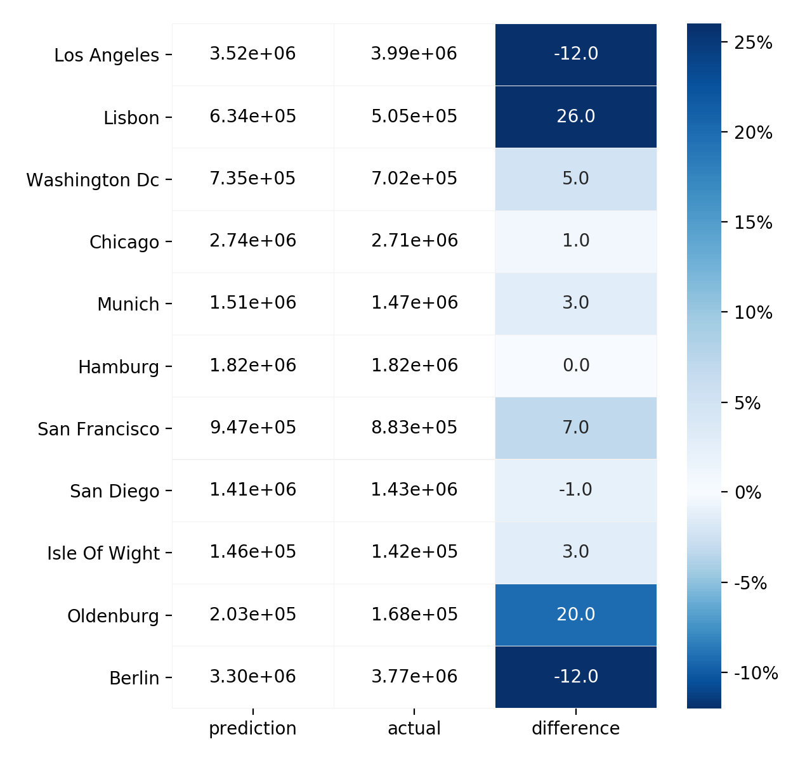

# OSM Population Prediction Model

_The associated blog post can be found [here](https://medium.com/@diogomatoschaves/estimating-the-population-of-arbitrarily-chosen-areas-533e81c2104e)_.

## Introduction

This project consists of a model to predict the population of a given area, solely based on 
features extracted from [OSM](https://wiki.openstreetmap.org/wiki/Map_Features) (OpenStreetMap) data. 
This model could have several uses in urban planning or traffic modelling for example, 
and as the OSM data is open source and constantly being updated, it's a free and accessible data for anyone to 
easily use to make estimates.

For this end a dataset was created, by taking a subset of the data gathered from reference [1], and augmenting it with more 
detailed OSM features with the help of [osm-feature-extractor](https://github.com/diogomatoschaves/osm-feature-extractor). 

The included data consists of ~30k equally sized hexagons which span across the area of 
Great Britain (England, Wales and Scotland). The data contains information regarding the population of each area, 
in turn derived from Facebook's 
[High Resolution Settlement Layer](https://research.fb.com/downloads/high-resolution-settlement-layer-hrsl/), 
which estimates the population from satellite imagery. Apart from the population, the data has features taken from 
OSM extracts, such as the number and area of buildings, the length of each type of road, 
the number of all kinds of shops (restaurants, groceries, etc) or the number of public transportation in the area. 
For a more detailed take on which features were used refer to this 
[document](https://github.com/diogomatoschaves/osm-feature-extractor/blob/master/feature_extractor/feature_augmenting/FEATURES.md).

After running the model, one can use [osm-feature-extractor](https://github.com/diogomatoschaves/osm-feature-extractor) to 
generate user-defined areas on which to estimate the population on. The referenced project has instructions on how to 
achieve that.

The main results of the model, using a **Lasso** regressor are:

| R2 score | Mean absolute error (inhabitants / km2) | 
|-----------|--------|
| 88.9%     |   98.8 | 


The full results of the model are presented in the section [Results](#results) below.


## Quick Start

In order to run the model, do the following steps:

1. Create a virtual environment using `conda`: <br>
```shell script
$ conda env create --file environment.yml
```
   
2. Download the dataset files:
```shell script
$ python donwload.py
```

3. Run the main script that pre-processes the data, trains the model and saves it.
```shell script
$ python main.py
```

You can adjust the project config variables in [proj.conf](proj.conf).

**input_data_file**: _Name of file with training data_ <br>
**out_file**: _Name of file to save model on_ <br>

One can also adjust specific model parameters in [settings.py](settings.py).

## Project Files

- [settings.py](settings.py) - file with configuration parameters
- [basic_features.py](./notebooks/basic_features.ipynb) - notebook with workflow with basic OSM features
- [all_features.py](./notebooks/all_features.ipynb) - notebook with workflow with extended OSM features
- [main.py](main.py) - main python script that wraps all pipeline steps
- [process_data.py](./preprocessing/process_data.py) - processes the data before being fed to the model
- [train_model.py](./model/train_model.py) - contains the logic where the data is fitted into the model
- [model_evaluation.py](./model/model_evaluation.py) - contains the logic for evaluating and showing the results of the model
- [pipeline_classes.py](./model/pipeline_classes.py) - contains classes that are used in the machine learning pipeline
- [helper_methods.py](./model/helper_methods.py) - contains helper methods used in the pipeline
- [hexagons_basic_features_sample.geojson]() - dataset of hexagons with basic features (sample data)
- [hexagons_all_features_sample.geojson]() - dataset of hexagons with extended features (sample data)

## Libraries

The main libraries used in this application are:

- [scikit-learn](https://github.com/scikit-learn/scikit-learn)
- [geopandas](https://github.com/geopandas/geopandas)
- [osm-feature-extractor](https://github.com/diogomatoschaves/osm-feature-extractor)
- [pandas](https://github.com/pandas-dev/pandas)
- [pyturf](https://github.com/diogomatoschaves/pyturf)
- [shapely](https://github.com/Toblerity/Shapely)
- [Rtree](https://github.com/Toblerity/rtree)
- [numpy](https://github.com/numpy/numpy)

## Results

Population estimates vs actual                  |  Coefficients of the model
:-------------------------:|:-------------------------:
  |   


## References

[1] - [Kontur Population: Global Population Density for 400m H3 Hexagons](https://data.humdata.org/dataset/kontur-population-dataset) <br>
[2] - [Bast, Hannah, 2015. Fine-Grained Population Estimation](http://ad-publications.informatik.uni-freiburg.de/GIS_population_BSW_2015.pdf)